# Markdown-FastRAG-MCP

[](https://pypi.org/project/markdown-fastrag-mcp/)
[](https://pypi.org/project/markdown-fastrag-mcp/)
[](LICENSE)
[](https://modelcontextprotocol.io)
[](https://python.org/)

A semantic search engine for markdown documents. An MCP server with **non-blocking background indexing**, **multi-provider embeddings** (Gemini, OpenAI, Vertex AI, Voyage), and **Milvus / Zilliz Cloud** vector storage — designed for **multi-agent concurrent access**.

Run Claude Code, Codex, Copilot, and Antigravity against the same document index simultaneously. Indexing returns instantly; poll for progress. Search while indexing continues.

> Ask *"what are the tradeoffs of microservices?"* and find your notes about service boundaries, distributed systems, and API design — even if none of them mention "microservices."


## Quick Start

```bash
pip install markdown-fastrag-mcp
```

Add to your MCP host config:

```json
{
  "mcpServers": {
    "markdown-rag": {
      "command": "uvx",
      "args": ["markdown-fastrag-mcp"],
      "env": {
        "EMBEDDING_PROVIDER": "gemini",
        "GEMINI_API_KEY": "${GEMINI_API_KEY}",
        "MILVUS_ADDRESS": "http://localhost:19530"
      }
    }
  }
}
```

> **Tip**: Omit `MILVUS_ADDRESS` for local-only use (defaults to SQLite-based Milvus Lite).

## Features

- **Semantic matching** — finds conceptually related content, not just keyword hits
- **Multi-provider embeddings** — Gemini, OpenAI, Vertex AI, Voyage, or local models
- **Async background indexing** — non-blocking `index_documents` returns instantly with `job_id`; poll with `get_index_status`
- **Event-loop-safe threading** — all sync I/O runs in worker threads via `asyncio.to_thread`
- **Smart incremental indexing** — mtime/size fast-path skips unchanged files without reading them
- **3-way delta scan** — classifies files as new/modified/deleted in one walk; new files skip Milvus delete
- **Smart chunk merging** — small chunks below `MIN_CHUNK_TOKENS` are merged with siblings; parent header context injected
- **Reconciliation sweep** — after each index run, queries all Milvus paths and deletes orphan vectors whose source files no longer exist on disk (catches ghosts missed by tracking-based pruning)
- **Search dedup** — per-file result limiting prevents a single document from dominating results
- **Scoped search & pruning** — `scope_path` filters results to subdirectories; pruning never wipes unrelated data
- **Workspace lock** — `MARKDOWN_WORKSPACE` fixes the root directory
- **Batch embedding & insert** — concurrent batches with 429 retry, chunked Milvus inserts under gRPC 64MB limit
- **Shell reindex CLI** — `reindex.py` for large-scale indexing with real-time progress logs
- **MCP native** — works with any MCP host (Claude Code, Cursor, Windsurf, VS Code, Antigravity, Codex, etc.)

## Tools

| Tool               | Description                                                                                                |
| ------------------ | ---------------------------------------------------------------------------------------------------------- |
| `index_documents`  | Start a background index job and return immediately with a `job_id`. Poll `get_index_status` for progress. |
| `get_index_status` | Poll a background index job status by `job_id` (or latest when omitted).                                   |
| `search_documents` | Semantic search across indexed documents. Returns top-k results with relevance scores and file paths.      |
| `clear_index`      | Reset the vector database and tracking state.                                                              |

## How It Works

```mermaid
flowchart LR
    A["📁 Markdown Files"] -->|"directory walk<br/>+ exclude filter"| B["🔍 Delta Scan<br/>mtime/size check"]
    B -->|changed| C["✂️ Chunk<br/>MarkdownNodeParser"]
    B -->|unchanged| SKIP["⏭️ Skip"]
    B -->|deleted| PRUNE["🗑️ Prune<br/>Milvus delete"]
    C --> M["🔗 Merge Small Chunks<br/>MIN_CHUNK_TOKENS=300"]
    M --> H["📑 Header Inject<br/>parent heading context"]
    H --> D["🧠 Embed<br/>Vertex/Gemini/OpenAI"]
    D -->|"batch insert"| E["💾 Milvus<br/>Vector Store"]

    F["🔎 Search Query"] --> D
    D -->|"k×5 oversample"| DD["🔄 Dedup<br/>max 2 per file"]
    DD --> G["📊 Top-K Results<br/>with relevance %"]

    style A fill:#2d3748,color:#e2e8f0
    style M fill:#744210,color:#fefcbf
    style H fill:#744210,color:#fefcbf
    style D fill:#553c9a,color:#e9d8fd
    style E fill:#2a4365,color:#bee3f8
    style DD fill:#553c9a,color:#e9d8fd
    style G fill:#22543d,color:#c6f6d5
    style PRUNE fill:#742a2a,color:#fed7d7
```



### Reconciliation Sweep

Tracking-based pruning catches deletions during normal indexing, but can miss **ghost vectors** when the tracking file is reset, files are moved outside the workspace, or a previous job was interrupted.

The **reconciliation sweep** runs automatically after each indexing job:

```mermaid
flowchart LR
    A["🔍 Query Milvus\n(all paths, paginated)"] --> B{"File exists\non disk?"}
    B -->|Yes| C["✅ Keep"]
    B -->|No| D["🗑️ Delete vectors\nfilter: path == '...'"]
    D --> E["📊 Report\nreconciled_orphans count"]

    style A fill:#2a4365,color:#bee3f8
    style C fill:#22543d,color:#c6f6d5
    style D fill:#742a2a,color:#fed7d7
    style E fill:#744210,color:#fefcbf
```



```json
{ "status": "succeeded", "reconciled_orphans": 280, "reconcile_seconds": 1.84 }
```

> Independent of `index_tracking.json` — directly compares Milvus ↔ disk as a safety net.

## Embedding Providers

| Provider              | `EMBEDDING_PROVIDER` | Default Model            | Auth            |
| --------------------- | -------------------- | ------------------------ | --------------- |
| **Vertex AI**         | `vertex`             | `gemini-embedding-001`   | Service Account |
| **Gemini**            | `gemini`             | `gemini-embedding-001`   | API key         |
| **OpenAI**            | `openai`             | `text-embedding-3-small` | API key         |
| **OpenAI-compatible** | `openai-compatible`  | `text-embedding-3-small` | API key         |
| **Voyage**            | `voyage`             | `voyage-3`               | API key         |
| **Local**             | `local`              | Milvus built-in (768d)   | —               |

## Configuration

### Core

| Variable              | Default                  | Description                                                 |
| --------------------- | ------------------------ | ----------------------------------------------------------- |
| `EMBEDDING_PROVIDER`  | `local`                  | `gemini`, `openai`, `openai-compatible`, `vertex`, `voyage` |
| `EMBEDDING_MODEL`     | (provider default)       | Model name override                                         |
| `EMBEDDING_DIM`       | `768`                    | Vector dimension                                            |
| `MILVUS_ADDRESS`      | `.db/milvus_markdown.db` | Milvus address or local file path                           |
| `MILVUS_TOKEN`        | —                        | Auth token (required for Zilliz Cloud)                      |
| `MARKDOWN_WORKSPACE`  | —                        | Lock workspace root                                         |
| `MARKDOWN_COLLECTION` | `markdown_vectors`       | Milvus collection name                                      |

### Indexing

| Variable                       | Default | Description                                     |
| ------------------------------ | ------- | ----------------------------------------------- |
| `MARKDOWN_CHUNK_SIZE`          | `2048`  | Token chunk size                                |
| `MARKDOWN_CHUNK_OVERLAP`       | `100`   | Token overlap between chunks                    |
| `MIN_CHUNK_TOKENS`             | `300`   | Small-chunk merge threshold                     |
| `DEDUP_MAX_PER_FILE`           | `1`     | Max results per file in search (`0` = disabled) |
| `EMBEDDING_BATCH_SIZE`         | `250`   | Texts per embedding API call                    |
| `EMBEDDING_BATCH_DELAY_MS`     | `0`     | Delay between batches (ms)                      |
| `EMBEDDING_CONCURRENT_BATCHES` | `2`     | Parallel embedding batches                      |
| `MILVUS_INSERT_BATCH`          | `5000`  | Rows per Milvus insert call                     |
| `MARKDOWN_BG_MAX_JOBS`         | `1`     | Max concurrent background index jobs            |
| `MARKDOWN_EXCLUDE_DIRS`        | —       | Extra directories to exclude (comma-separated)  |
| `MARKDOWN_EXCLUDE_FILES`       | —       | Extra files to exclude (comma-separated)        |

### Provider Auth

| Variable                         | Description                             |
| -------------------------------- | --------------------------------------- |
| `GEMINI_API_KEY`                 | Gemini API key                          |
| `OPENAI_API_KEY`                 | OpenAI API key                          |
| `VOYAGE_API_KEY`                 | Voyage API key                          |
| `EMBEDDING_API_KEY`              | OpenAI-compatible API key               |
| `EMBEDDING_BASE_URL`             | OpenAI-compatible base URL              |
| `GOOGLE_APPLICATION_CREDENTIALS` | Service account JSON path for Vertex AI |
| `VERTEX_PROJECT`                 | GCP project ID                          |
| `VERTEX_LOCATION`                | Vertex AI region (default: us-central1) |

## Shell Reindex CLI

For large-scale full rebuilds, use the CLI instead of MCP:

```bash
EMBEDDING_PROVIDER=vertex \
MILVUS_ADDRESS=http://localhost:19530 \
uv run python reindex.py /path/to/vault

# Full rebuild
uv run python reindex.py /path/to/vault --force
```

## Performance

| Metric                                | Result                       |
| ------------------------------------- | ---------------------------- |
| Unchanged files — hash computations   | **0** (mtime/size fast-path) |
| Changed file — embed + insert         | **~3 seconds**               |
| No changes — full scan                | **instant**                  |
| Full reindex (1300 files, 23K chunks) | **~7–8 minutes**             |

## Documentation

Detailed technical documentation is available in the [`docs/`](docs/) directory:

- [Embedding Provider Setup](docs/embedding-providers.md)
- [Milvus / Zilliz Cloud Setup](docs/milvus-setup.md)
- [Background Indexing Architecture](docs/indexing-architecture.md)
- [Optimization Techniques](docs/optimization.md)

## License

Apache 2.0 — see [LICENSE](LICENSE) for full text.
