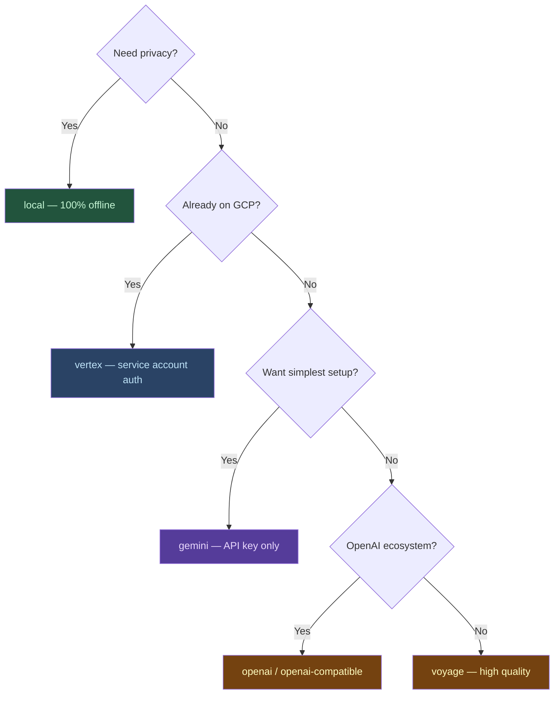

# Embedding Providers

markdown-fastrag-mcp supports multiple embedding providers. Set via `EMBEDDING_PROVIDER` environment variable.



## Provider Comparison

| Provider              | `EMBEDDING_PROVIDER` | Default Model            | Dimensions | Auth            | Batch Size |
| --------------------- | -------------------- | ------------------------ | ---------- | --------------- | ---------- |
| **Vertex AI**         | `vertex`             | `gemini-embedding-001`   | 768        | Service Account | 250        |
| **Gemini**            | `gemini`             | `gemini-embedding-001`   | 768        | API key         | 250        |
| **OpenAI**            | `openai`             | `text-embedding-3-small` | 1536       | API key         | 250        |
| **OpenAI-compatible** | `openai-compatible`  | `text-embedding-3-small` | 1536       | API key         | 250        |
| **Voyage**            | `voyage`             | `voyage-3`               | 1024       | API key         | 250        |
| **Local**             | `local`              | Milvus built-in (768d)   | 768        | —               | —          |

## Vertex AI

Google Cloud's managed embedding service. Best for GCP-native deployments.

```json
{
  "env": {
    "EMBEDDING_PROVIDER": "vertex",
    "GOOGLE_APPLICATION_CREDENTIALS": "/path/to/service-account.json",
    "VERTEX_PROJECT": "your-gcp-project-id",
    "VERTEX_LOCATION": "us-central1"
  }
}
```

**Requirements:**
- Service account JSON with `aiplatform.endpoints.predict` permission
- `VERTEX_PROJECT` must match the service account's project
- `VERTEX_LOCATION` defaults to `us-central1`

## Gemini

Google's consumer-facing API. Simpler setup than Vertex, same models.

```json
{
  "env": {
    "EMBEDDING_PROVIDER": "gemini",
    "GEMINI_API_KEY": "your-api-key"
  }
}
```

Get your key from [Google AI Studio](https://aistudio.google.com/apikey).

## OpenAI

```json
{
  "env": {
    "EMBEDDING_PROVIDER": "openai",
    "OPENAI_API_KEY": "sk-..."
  }
}
```

## OpenAI-compatible

For any provider exposing an OpenAI-compatible `/v1/embeddings` endpoint (e.g., Ollama, LM Studio, Azure OpenAI).

```json
{
  "env": {
    "EMBEDDING_PROVIDER": "openai-compatible",
    "EMBEDDING_API_KEY": "your-key",
    "EMBEDDING_BASE_URL": "https://your-endpoint.com/v1",
    "EMBEDDING_MODEL": "your-model-name"
  }
}
```

## Voyage

```json
{
  "env": {
    "EMBEDDING_PROVIDER": "voyage",
    "VOYAGE_API_KEY": "your-key"
  }
}
```

## Local (Default)

Uses Milvus Lite's built-in embedding function. No API calls, fully offline.

No configuration needed — just omit `EMBEDDING_PROVIDER` or set it to `local`.

> **Note:** Local embedding generates 768-dimensional vectors. If switching from a provider with different dimensions, you'll need to clear the index and re-embed (`clear_index` → `index_documents`).

## Tuning

| Variable                       | Default | Description                                |
| ------------------------------ | ------- | ------------------------------------------ |
| `EMBEDDING_MODEL`              | —       | Override model name                        |
| `EMBEDDING_DIM`                | `768`   | Vector dimension                           |
| `EMBEDDING_BATCH_SIZE`         | `250`   | Texts per API call                         |
| `EMBEDDING_BATCH_DELAY_MS`     | `0`     | Delay between batches (ms), helps with 429 |
| `EMBEDDING_CONCURRENT_BATCHES` | `2`     | Parallel embedding batches                 |

## Rate Limiting & Retries

The server implements automatic retry with exponential backoff for 429 (rate limit) errors:

1. First retry after 1s
2. Second retry after 2s
3. Third retry after 4s (max 3 retries)

For high-volume indexing, increase `EMBEDDING_BATCH_DELAY_MS` to avoid hitting rate limits:

```json
{
  "env": {
    "EMBEDDING_BATCH_SIZE": "100",
    "EMBEDDING_BATCH_DELAY_MS": "500",
    "EMBEDDING_CONCURRENT_BATCHES": "1"
  }
}
```
