# Background Indexing Architecture

markdown-fastrag-mcp uses **fully non-blocking background indexing**. Every indexing operation returns instantly with a `job_id`; the actual work runs in a background task.

## Non-Blocking Flow

```mermaid
sequenceDiagram
    participant Agent
    participant MCP as markdown-fastrag-mcp
    participant BG as Background Task
    participant Store as Milvus

    Agent->>MCP: index_documents()
    MCP->>BG: asyncio.create_task()
    MCP-->>Agent: {job_id: "abc123", status: "accepted"}
    Note over Agent: ⚡ Returns instantly

    loop Poll every 2-3s
        Agent->>MCP: get_index_status(job_id)
        MCP-->>Agent: {status: "running", progress: "150/500 files"}
    end

    BG->>Store: batch insert vectors
    BG-->>MCP: done

    Agent->>MCP: get_index_status(job_id)
    MCP-->>Agent: {status: "succeeded", reconciled_orphans: 0}

    Agent->>MCP: search_documents(query)
    MCP-->>Agent: [results]
```



## Event-Loop-Safe Threading

Python's `asyncio` event loop is single-threaded. Any blocking call (file I/O, Milvus gRPC, CPU-bound hashing) freezes the entire server—no MCP requests can be processed until it completes.

markdown-fastrag-mcp wraps **all sync operations** in `asyncio.to_thread()`:

| Operation           | Without `to_thread`         | With `to_thread`    |
| ------------------- | --------------------------- | ------------------- |
| `os.path.exists()`  | Blocks event loop ~0.1ms    | Runs in thread pool |
| `os.stat()`         | Blocks event loop ~0.1ms    | Runs in thread pool |
| File read (10 KB)   | Blocks event loop ~1ms      | Runs in thread pool |
| Milvus insert (RPC) | Blocks event loop ~50–200ms | Runs in thread pool |
| Milvus delete (RPC) | Blocks event loop ~10–50ms  | Runs in thread pool |

This means `search_documents` and `get_index_status` remain responsive even during heavy indexing.

## 3-Way Delta Scan

Instead of processing all files every time, the indexer classifies files into three categories in a single directory walk:

```mermaid
flowchart TD
    A["Walk directory"] --> B{"In tracking file?"}
    B -->|No| C["📄 NEW FILE\nskip Milvus delete"]
    B -->|Yes| D{"mtime/size\nchanged?"}
    D -->|No| E["⏭️ SKIP\nunchanged"]
    D -->|Yes| F["✏️ MODIFIED\ndelete old vectors first"]

    G["Tracking file entries\nnot found on disk"] --> H["🗑️ DELETED\nprune from Milvus"]

    style C fill:#22543d,color:#c6f6d5
    style E fill:#2a4365,color:#bee3f8
    style F fill:#744210,color:#fefcbf
    style H fill:#742a2a,color:#fed7d7
```



### Why this matters

For new files, the server skips the Milvus delete call entirely. Each Milvus gRPC delete costs ~10–50ms of network round-trip. On a first-time index of 1,288 files, this saves **12–64 seconds** of unnecessary network calls.

| Category      | Action                              | Milvus delete? |
| ------------- | ----------------------------------- | -------------- |
| **New**       | Chunk → Embed → Insert              | ❌ No           |
| **Modified**  | Delete old → Chunk → Embed → Insert | ✅ Yes          |
| **Deleted**   | Delete from Milvus + tracking       | ✅ Yes          |
| **Unchanged** | Skip entirely                       | ❌ No           |

### mtime/size Fast-Path

The first check uses `os.stat()` to compare `mtime` and `size` against the tracking file. If both match, the file is skipped **without reading its contents**. This means unchanged files cost only one `stat()` call (~0.1ms), not a full file read + hash computation.

## Post-Index Reconciliation

After the index job is marked `succeeded`, a **reconciliation sweep** runs:

1. Query all unique `path` values from Milvus (paginated, max 16,384 per query)
2. Check `os.path.exists()` for each path
3. Delete vectors for paths that no longer exist on disk
4. Report `reconciled_orphans` count in the status response

This catches ghost vectors missed by tracking-based pruning (e.g., after `clear_index` resets the tracking file).

## Timing Metrics

The indexer reports detailed timing for each phase:

```json
{
  "status": "succeeded",
  "total_seconds": 45.2,
  "embed_seconds": 38.1,
  "insert_seconds": 3.4,
  "prune_seconds": 0.8,
  "reconcile_seconds": 1.2,
  "delta": {
    "new": 50,
    "modified": 12,
    "deleted": 3,
    "unchanged": 1223
  }
}
```
