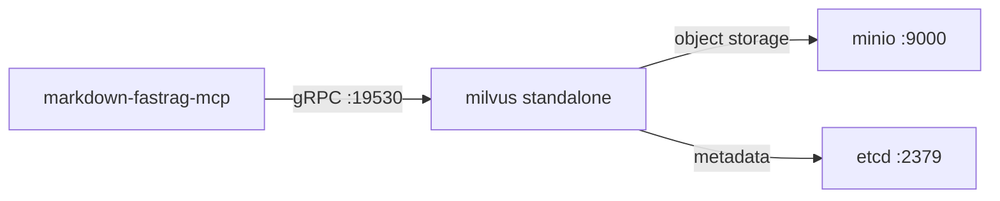

# Milvus / Zilliz Cloud Setup

## Overview

markdown-fastrag-mcp supports two vector storage backends:

| Feature     | Milvus Lite (Default)    | Milvus Standalone (Docker) | Zilliz Cloud        |
| ----------- | ------------------------ | -------------------------- | ------------------- |
| Setup       | Zero-config, single file | Self-hosted, 3 containers  | Managed SaaS        |
| RAM         | ~200 MB                  | ~2.5 GB idle               | None (serverless)   |
| Multi-agent | ❌ Single-process         | ✅ Concurrent access        | ✅ Concurrent access |
| Scaling     | Single machine only      | Manual                     | Auto-scaling        |
| Best for    | Solo dev, testing        | Local multi-agent          | Team use, CI/CD     |

## Milvus Lite (Default)

No configuration needed. Uses a local SQLite-backed file:

```
.db/milvus_markdown.db
```

## Milvus Standalone (Docker)

Milvus Standalone runs **3 containers** working together:



### Requirements

| Resource | Minimum  | Recommended               |
| -------- | -------- | ------------------------- |
| RAM      | **4 GB** | 8 GB+                     |
| Disk     | 10 GB    | 50 GB+ (scales with data) |
| CPU      | 2 cores  | 4+ cores                  |
| Docker   | v20+     | Latest                    |

> ⚠️ **RAM is critical.** Milvus idles at ~2.5 GB across 3 containers. Machines with < 4 GB will experience swap thrashing and gRPC timeouts.

### Docker Compose

```yaml
# docker-compose.yml
version: '3.5'
services:
  etcd:
    image: coreos/etcd:v3.5.18
    environment:
      ETCD_AUTO_COMPACTION_MODE: revision
      ETCD_AUTO_COMPACTION_RETENTION: "1000"
      ETCD_QUOTA_BACKEND_BYTES: "4294967296"
    command: etcd -advertise-client-urls=http://127.0.0.1:2379 -listen-client-urls http://0.0.0.0:2379 --data-dir /etcd
    volumes:
      - etcd-data:/etcd

  minio:
    image: minio/minio:RELEASE.2023-03-20T20-16-18Z
    environment:
      MINIO_ACCESS_KEY: minioadmin
      MINIO_SECRET_KEY: minioadmin
    command: minio server /minio_data --console-address ":9001"
    ports:
      - "9000:9000"
      - "9001:9001"
    volumes:
      - minio-data:/minio_data

  standalone:
    image: milvusdb/milvus:v2.5.1
    command: ["milvus", "run", "standalone"]
    environment:
      ETCD_ENDPOINTS: etcd:2379
      MINIO_ADDRESS: minio:9000
    ports:
      - "19530:19530"
      - "9091:9091"
    volumes:
      - milvus-data:/var/lib/milvus
    depends_on:
      - etcd
      - minio

volumes:
  etcd-data:
  minio-data:
  milvus-data:
```

### Start & Verify

```bash
docker compose up -d
docker compose ps        # All 3 should be running
docker stats --no-stream  # Check RAM (~2.5 GB total)
curl http://localhost:19530/v1/vector/collections  # Verify API
```

### Configure

```json
{
  "env": {
    "MILVUS_ADDRESS": "http://localhost:19530"
  }
}
```

### Lifecycle

```bash
docker compose stop      # Stop (preserves data)
docker compose start     # Restart after reboot
docker compose down -v   # Full reset (removes all vectors)
docker compose logs -f standalone  # Debug logs
```

### Monitoring

- **MinIO Console**: http://localhost:9001 (minioadmin / minioadmin)
- **Milvus Health**: http://localhost:9091/healthz
- **Container RAM**: `docker stats --no-stream`

## Zilliz Cloud (Managed Milvus)

For teams or serverless deployments:

```json
{
  "env": {
    "MILVUS_ADDRESS": "https://in03-xxxx.api.gcp-us-west1.zillizcloud.com",
    "MILVUS_TOKEN": "your-zilliz-api-key"
  }
}
```

Get your URI and API key from the [Zilliz Console](https://cloud.zilliz.com) → Cluster → Connect.

Free tier: 2 collections, 1M vectors.

## Troubleshooting

| Symptom                               | Cause                        | Fix                                                                              |
| ------------------------------------- | ---------------------------- | -------------------------------------------------------------------------------- |
| gRPC timeout / connection refused     | Milvus not fully started     | Wait 30–60s after `docker compose up -d`, check `docker compose logs standalone` |
| Swap thrashing, slow queries          | < 4 GB RAM                   | Upgrade RAM or use Milvus Lite for single-agent setups                           |
| `etcd: mvcc: database space exceeded` | etcd compaction backlog      | `docker compose restart etcd`                                                    |
| Milvus OOM killed                     | RAM pressure from other apps | Close heavy apps or increase Docker memory limit                                 |
